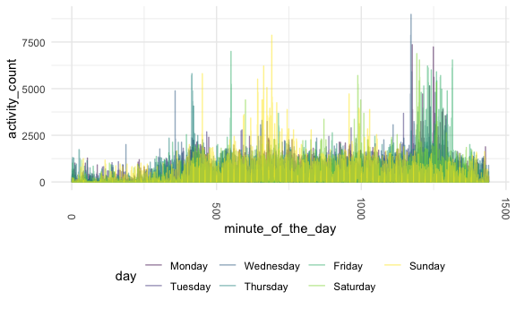
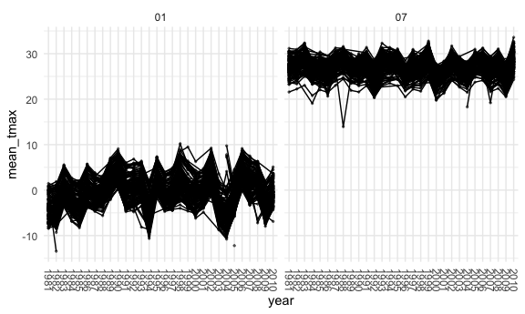
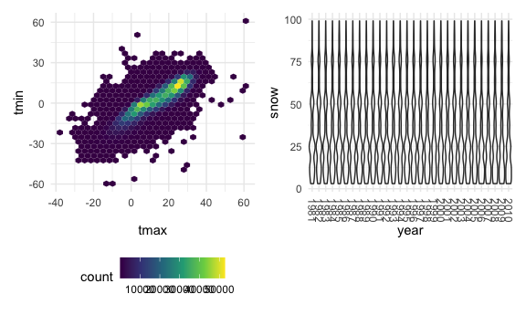

Homework 3
================
Jiayi Zhou

## Problem 1

``` r
data("instacart")
```

This dataset contain 1384617 rows and 15 columns.

Observations are the level of items in orders by users. There are user /
order variables: user ID, order ID, order hours of the day, and so on.
There are also item variables: product id, product name, aisle,
department.

**1. How many aisles are there, and which aisles are the most items
ordered from?**

``` r
instacart %>% 
  count(aisle) %>% 
  arrange(desc(n))
```

    ## # A tibble: 134 x 2
    ##    aisle                              n
    ##    <chr>                          <int>
    ##  1 fresh vegetables              150609
    ##  2 fresh fruits                  150473
    ##  3 packaged vegetables fruits     78493
    ##  4 yogurt                         55240
    ##  5 packaged cheese                41699
    ##  6 water seltzer sparkling water  36617
    ##  7 milk                           32644
    ##  8 chips pretzels                 31269
    ##  9 soy lactosefree                26240
    ## 10 bread                          23635
    ## # … with 124 more rows

**2. Make a plot that shows the number of items ordered in each aisle,
limiting this to aisles with more than 10000 items ordered. Arrange
aisles sensibly, and organize your plot so others can read it.**

``` r
instacart %>% 
  count(aisle) %>% 
  filter(n > 10000) %>% 
  mutate( 
    aisle = factor(aisle),
    aisle = fct_reorder(aisle, n)
    ) %>% 
  ggplot(aes(x = aisle, y = n)) +
  geom_point() +
  theme(axis.text.x = element_text(angle = 270,  vjust = 0.5,  hjust = 1))
```


**3. Make a table showing the three most popular items in each of the
aisles “baking ingredients”, “dog food care”, and “packaged vegetables
fruits”. Include the number of times each item is ordered in your
table.**

``` r
instacart %>% 
  filter(aisle %in% c("baking ingredients", "dog food care", "packaged vegetables fruits")) %>% 
  group_by(aisle) %>% 
  count(product_name) %>% 
  mutate(rank = min_rank(desc(n))) %>% 
  filter(rank < 4) %>% 
  arrange(aisle, rank) %>% 
  knitr::kable()
```

| aisle                      | product\_name                                 |    n | rank |
| :------------------------- | :-------------------------------------------- | ---: | ---: |
| baking ingredients         | Light Brown Sugar                             |  499 |    1 |
| baking ingredients         | Pure Baking Soda                              |  387 |    2 |
| baking ingredients         | Cane Sugar                                    |  336 |    3 |
| dog food care              | Snack Sticks Chicken & Rice Recipe Dog Treats |   30 |    1 |
| dog food care              | Organix Chicken & Brown Rice Recipe           |   28 |    2 |
| dog food care              | Small Dog Biscuits                            |   26 |    3 |
| packaged vegetables fruits | Organic Baby Spinach                          | 9784 |    1 |
| packaged vegetables fruits | Organic Raspberries                           | 5546 |    2 |
| packaged vegetables fruits | Organic Blueberries                           | 4966 |    3 |

**4. Make a table showing the mean hour of the day at which Pink Lady
Apples and Coffee Ice Cream are ordered on each day of the week; format
this table for human readers (i.e. produce a 2 x 7 table).**

``` r
instacart %>% 
  filter(product_name %in% c("Pink Lady Apples", "Coffee Ice Cream")) %>% 
  group_by(product_name, order_dow) %>% 
  summarize(mean_hour = mean(order_hour_of_day)) %>% 
  pivot_wider(
    names_from = order_dow,
    values_from = mean_hour
  ) %>% 
   knitr::kable()
```

    ## `summarise()` regrouping output by 'product_name' (override with `.groups` argument)

| product\_name    |        0 |        1 |        2 |        3 |        4 |        5 |        6 |
| :--------------- | -------: | -------: | -------: | -------: | -------: | -------: | -------: |
| Coffee Ice Cream | 13.77419 | 14.31579 | 15.38095 | 15.31818 | 15.21739 | 12.26316 | 13.83333 |
| Pink Lady Apples | 13.44118 | 11.36000 | 11.70213 | 14.25000 | 11.55172 | 12.78431 | 11.93750 |

## Problem 2

**1. Load, tidy, and otherwise wrangle the data. Your final dataset
should include all originally observed variables and values; have useful
variable names; include a weekday vs weekend variable; and encode data
with reasonable variable classes. Describe the resulting dataset
(e.g. what variables exist, how many observations, etc).**

``` r
accelerometer_df = 
  read_csv("./hw3_data/accel_data.csv") %>% 
  janitor::clean_names() %>% 
  pivot_longer(
    activity_1:activity_1440, 
    names_to = "minute_of_the_day",
    names_prefix = "activity_", 
    values_to = "activity_count"
  ) %>% 
  mutate(
    weekday_vs_weekend = 
      case_when(
        day %in% c("Monday", "Tuesday", "Wednesday", "Thursday", "Friday") ~ "weekday",
        day %in% c("Saturday", "Sunday") ~ "weekend"
      )) %>% 
    mutate(
      minute_of_the_day = as.integer(minute_of_the_day),
      week = factor(week),
      day = factor(day, levels = c("Monday", "Tuesday", "Wednesday", "Thursday", "Friday", "Saturday", "Sunday"))
    ) %>% 
  relocate(weekday_vs_weekend, .after = day)
```

    ## Parsed with column specification:
    ## cols(
    ##   .default = col_double(),
    ##   day = col_character()
    ## )

    ## See spec(...) for full column specifications.

The resulting dataset has 50400 rows and 6 columns. There are 6
variables, where the “week” “day\_id” "“day” variables are retained from
the original dataset. Every 1440 observations is a day, and there are 35
days in total record by the dataset. The new factor variable
“weekday\_vs\_weekend” separate the observations into two categories:
weekday and weekend. The “minute\_of\_the\_day” and “activity\_count”
variables store the collected information of the original
activity1-1440. For each day, “minute\_of\_the\_day” will count from the
1st minute to the last 1440th minute then repeat from 1 as the next day
start. At the same time, activity\_count record the activity count of
each corresponding minute.

**2. Traditional analyses of accelerometer data focus on the total
activity over the day. Using your tidied dataset, aggregate across
minutes to create a total activity variable for each day, and create a
table showing these totals. Are any trends apparent?**

``` r
accelerometer_df %>% 
  group_by(week, day) %>% 
  summarize(total_activity = sum(activity_count)) %>% 
 pivot_wider(
   names_from = week,
   values_from = total_activity
   ) %>% 
  knitr::kable()
```

    ## `summarise()` regrouping output by 'week' (override with `.groups` argument)

| day       |         1 |      2 |      3 |      4 |      5 |
| :-------- | --------: | -----: | -----: | -----: | -----: |
| Monday    |  78828.07 | 295431 | 685910 | 409450 | 389080 |
| Tuesday   | 307094.24 | 423245 | 381507 | 319568 | 367824 |
| Wednesday | 340115.01 | 440962 | 468869 | 434460 | 445366 |
| Thursday  | 355923.64 | 474048 | 371230 | 340291 | 549658 |
| Friday    | 480542.62 | 568839 | 467420 | 154049 | 620860 |
| Saturday  | 376254.00 | 607175 | 382928 |   1440 |   1440 |
| Sunday    | 631105.00 | 422018 | 467052 | 260617 | 138421 |

There is no prominent increasing or decreasing trend in total activity
count through out each week and across the 5 weeks. However, the
variation of the total activity over the day is much smaller on
Thursdays, Tuesdays, Wednesdays.if compare the total activity count
across the 5 Fridays, Mondays, Saturdays, and Sundays, the variation is
vary large. Furthermore, during the week 4 adn week 5 on Saturday,only
the baseline activity counts 1440 have been shown. This imply that the
either the patient forget to wear the device for the day or there have
been malfunction.

**3. Accelerometer data allows the inspection activity over the course
of the day. Make a single-panel plot that shows the 24-hour activity
time courses for each day and use color to indicate day of the week.
Describe in words any patterns or conclusions you can make based on this
graph.**

``` r
accelerometer_df %>% 
  group_by(week, day) %>% 
  ggplot(aes(x = minute_of_the_day, y = activity_count, color = day)) +
  geom_line() +
  scale_x_discrete(
    breaks = c(180,360,540,720,900,1080,1260,1440),
    labels = c("3h","6h", "9h", "12h", "15h", "18h", "21h", "24h")
  )
```



## Problem 3

``` r
data("ny_noaa")
```

This dataset contain 2595176 rows and 7 columns. Each observation is
defined by 7 variables: id is the weather station ID. date is the date
of observation. prcp is precipitation with unit tenth of mm. snow is the
snowfall in mm. snwd is the snow depth in mm. tmax is maximum
temperature in tenth of degree C, and tmin is the minimum temperature in
tenth of degree C.

**1. Do some data cleaning. Create separate variables for year, month,
and day. Ensure observations for temperature, precipitation, and
snowfall are given in reasonable units. For snowfall, what are the most
commonly observed values? Why?**

``` r
ny_noaa_df = 
  ny_noaa %>% 
  separate(date, into = c("year", "month", "day"), sep = "-") %>% 
  mutate(
    tmax = as.numeric(tmax),
    tmin = as.numeric(tmin),
    tmax = tmax / 10,
    tmin = tmin / 10,
    prcp = prcp / 10
    )

ny_noaa_df %>% 
  count(snow) %>% 
  arrange(desc(n))
```

    ## # A tibble: 282 x 2
    ##     snow       n
    ##    <int>   <int>
    ##  1     0 2008508
    ##  2    NA  381221
    ##  3    25   31022
    ##  4    13   23095
    ##  5    51   18274
    ##  6    76   10173
    ##  7     8    9962
    ##  8     5    9748
    ##  9    38    9197
    ## 10     3    8790
    ## # … with 272 more rows

To tidy up the dataset, I first separated the date to year, month and
day. Then, changing the tmax and tmin to numeric variables was
performed. Furthermore, by dividing 10, the units for tmax, tmin and
prcp will be converted from tenth to the mm and tenth to the degree C to
mm and degree C.

For snowfall, the most commonly observed values was 0 since we counted
the most observations from it.

**2. Make a two-panel plot showing the average max temperature in
January and in July in each station across years. Is there any
observable / interpretable structure? Any outliers?**

``` r
ny_noaa_df %>% 
  filter(month %in% c("01", "07")) %>% 
  group_by(id, year, month) %>% 
  summarize(
    mean_tmax = mean(tmax, na.rm = TRUE)
  ) %>% 
  ggplot(aes(x = year, y = mean_tmax,group = id))+
  geom_point() +
  geom_path() +
  facet_grid(.~month) +
  theme(axis.text.x = element_text(angle = 270,  vjust = 0.5,  hjust = 1))
```

    ## `summarise()` regrouping output by 'id', 'year' (override with `.groups` argument)

    ## Warning: Removed 5970 rows containing missing values (geom_point).

    ## Warning: Removed 5931 row(s) containing missing values (geom_path).



**Make a two-panel plot showing (i) tmax vs tmin for the full dataset
(note that a scatterplot may not be the best option); and (ii) make a
plot showing the distribution of snowfall values greater than 0 and less
than 100 separately by year.** 1.

``` r
library(patchwork)
```

``` r
tmax_vs_tmin = 
  ny_noaa_df %>% 
  ggplot(aes(x = tmax, y = tmin)) +
  geom_hex()

dist_snowfall = 
  ny_noaa_df %>% 
  filter(snow < 100) %>% 
  filter(snow > 0) %>% 
  ggplot(aes(x = year, y = snow)) +
  geom_boxplot() +
  theme(axis.text.x = element_text(angle = 270,  vjust = 0.5,  hjust = 1))

tmax_vs_tmin + dist_snowfall
```

    ## Warning: Removed 1136276 rows containing non-finite values (stat_binhex).


